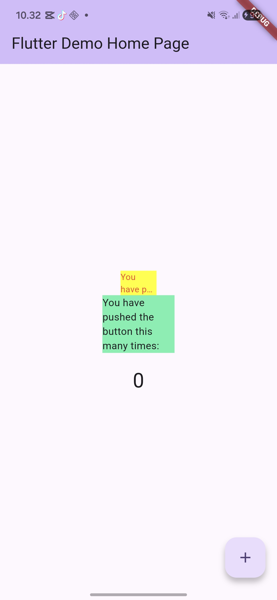

# flutter_plugin_pubdev

A new Flutter project.

## Getting Started

1. Selesaikan Praktikum tersebut, lalu dokumentasikan dan push ke repository Anda berupa screenshot hasil pekerjaan beserta penjelasannya di file README.md!
Hasil Running

2. Jelaskan maksud dari langkah 2 pada praktikum tersebut!
Jawab : Maksud dari langkah 2 adalah dengan menambahkan plugin auto_size_text ke project Flutter agar bisa menggunakan widget AutoSizeText, yaitu teks yang otomatis menyesuaikan ukuran agar tidak overflow.
3. Jelaskan maksud dari langkah 5 pada praktikum tersebut!
Jawab : Maksud dari langkah 5 adalah dengam membuat variabel text dan constructor agar widget RedTextWidget bisa menerima input teks dari luar lebih fleksibel dan reusable.
4. Pada langkah 6 terdapat dua widget yang ditambahkan, jelaskan fungsi dan perbedaannya!
Jawab : Fungsi dari RedTextWidget (AutoSizeText) adalh teksnya otomatis mengecil jika ruang sempit, tidak overflow dan lebih responsif. Sedangkan Fungsi dari teks adalah ukuran teknya tetap, bisa overflow jika ruang kecil dan tidak flesibel jadi perbedaan utama dari keduanya adalah AutoSizeText menyesuaikan ukuran teks sedangkan text tidak.
5. Jelaskan maksud dari tiap parameter yang ada di dalam plugin auto_size_text berdasarkan tautan pada dokumentasi ini !
Jawab :
AutoSizeText(
  text,
  style: TextStyle(...),
  maxLines: 2,
  overflow: TextOverflow.ellipsis,
)
- text untuk isi teks yang ditampilkan.
- style untuk mengatur tampilan (warna, ukuran font, dll).
- maxLines untuk batas maksimal jumlah baris.
- overflow untuk mengatur teks jika melebihi batas.

- [Learn Flutter](https://docs.flutter.dev/get-started/learn-flutter)
- [Write your first Flutter app](https://docs.flutter.dev/get-started/codelab)
- [Flutter learning resources](https://docs.flutter.dev/reference/learning-resources)

For help getting started with Flutter development, view the
[online documentation](https://docs.flutter.dev/), which offers tutorials,
samples, guidance on mobile development, and a full API reference.
