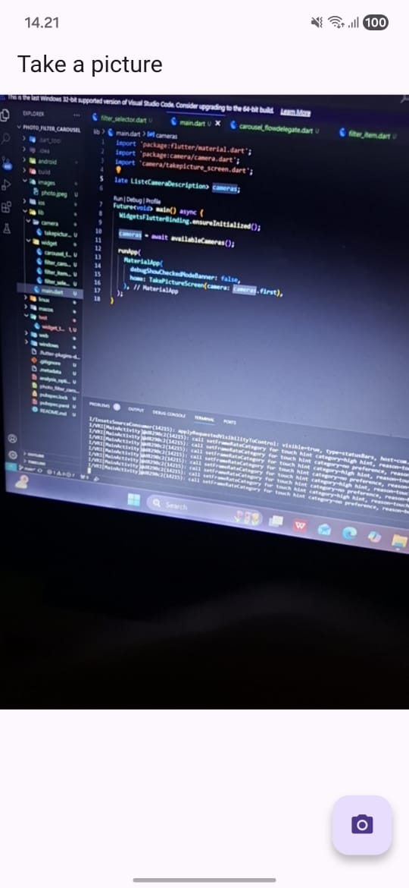
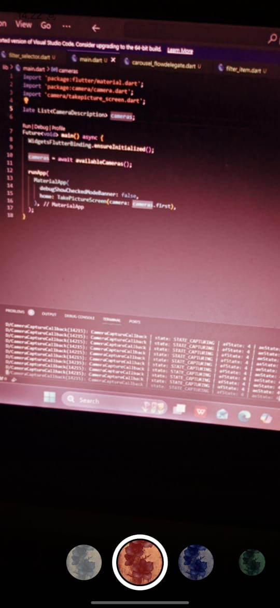

# photo_filter_carousel

A new Flutter project.

## Getting Started

1. Selesaikan Praktikum 1 dan 2, lalu dokumentasikan dan push ke repository Anda berupa screenshot setiap hasil pekerjaan beserta penjelasannya di file README.md! Jika terdapat error atau kode yang tidak dapat berjalan, silakan Anda perbaiki sesuai tujuan aplikasi dibuat!

2. Gabungkan hasil praktikum 1 dengan hasil praktikum 2 sehingga setelah melakukan pengambilan foto, dapat dibuat filter carouselnya!

3. Jelaskan maksud void async pada praktikum 1?
Jawab : Maksud dari async adalah digunakan untuk membuat fungsi berjalan secara tidak langsung dan biasanya dipakai dengan await unutk menunggu proses selesai tanpa membuat aplikasi freese contohnya seperti mengambil foto dari kamera
4. Jelaskan fungsi dari anotasi @immutable dan @override ?
Jawab : Anotasi @immutable digunakan untuk menandakan bahwa data dalam suatu class tidak boleh diubah setelah dibuat, sehingga semua variabel harus bersifat final dan membantu menjaga konsistensi data khususnya pada widget Flutter.Sedangkan @override digunakan untuk mengganti (override) method dari parent class, seperti method build dengan tujuan memberi tahu compiler bahwa method tersebut memang ditimpa serta membantu menghindari kesalahan penulisan method.

A few resources to get you started if this is your first Flutter project:

- [Learn Flutter](https://docs.flutter.dev/get-started/learn-flutter)
- [Write your first Flutter app](https://docs.flutter.dev/get-started/codelab)
- [Flutter learning resources](https://docs.flutter.dev/reference/learning-resources)

For help getting started with Flutter development, view the
[online documentation](https://docs.flutter.dev/), which offers tutorials,
samples, guidance on mobile development, and a full API reference.
